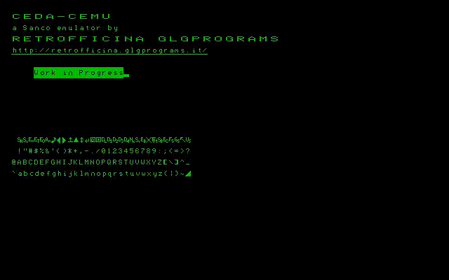

# ceda-cemu

An emulator for Sanco 8000, a Z80-based French computer.
This time, written in plain old C.



## Build
```
git submodule init
git submodule update
script/docker script/build release
```

## Run
First, you need a copy of the ROMs inside the `rom/` directory:
- [BIOS ROM](https://github.com/GLGPrograms/ceda-home/blob/main/README.md#rom)
- [character ROM](https://github.com/GLGPrograms/ceda-home/blob/main/README.md#rom)

Optionally (but strongly suggested) you also need:
- [CP/M disk](https://github.com/GLGPrograms/ceda-cpm) (.bin)

Then:
```
build/release/ceda      # run the emulator
telnet 127.0.0.1 52954  # connect to command line interface
```

Lore: *52954* is just the decimal version of `0xCEDA`.

Emulation can be started/stopped/resumed via the provided command line debugger accessible via the telnet session.

In the command line, type:
- `mount <image.bin>` to mount the CP/M floppy image (optional);
- `continue` to start the execution;
- `help` to get a full list of all supported commands;

To emulate the `BOOT` key of the original keyboard, press `INS`.

## Development
- to add debug symbols:
```
script/docker script/build debug
```

- to compile tests
```
script/docker script/build test
```

- to run tests:
```
build/test/ceda
```

### Script
The `script/` directory contains some useful script for development.
It is suggested to run them in the docker container by prefixing them with `script/docker` in order to use the correct version of the dev tools.

- `format`: clang-format sources
- `valgrind`: check for memory leaks

## About
This emulator is part of a documentation effort by [Retrofficina GLG Programs](https://retrofficina.glgprograms.it/). See [ceda-home](https://github.com/GLGPrograms/ceda-home).
