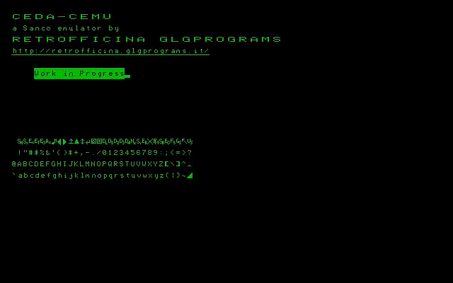

# ceda-cemu

An emulator for Sanco 8000, a Z80-based French computer.
This time, written in plain old C.

This software is released under the terms of the GNU GPLv3 license.



## Build

Make sure to specify an user-writable prefix path to install the software and the binary blobs.
Note: this command will also download the needed binary blobs.

```
git submodule init
git submodule update
cmake -B build -DCMAKE_INSTALL_PREFIX=$(pwd)/root
make -C build install
```

## Quick start
```
root/bin/ceda           # run the emulator
```
Press the `BOOT` key to boot.
Note: since your keyboard probably does not have a `BOOT` key, use `INS` instead :smile:

### Also useful

You can connect to the emulator command line interface via:
```
telnet 127.0.0.1 52954  # (52954 is 0xCEDA)
```

- The provided command line allows the user to thinker with the emulated software
  - mount/umount disk images
  - start/stop emulation, pause, add/delete exec/mem read/mem write/io in/io out breakpoints, step, disassemble
  - read/write memory, load/save chunks to disk
  - emulate read/write in I/O space, trigger interrupts manually
- Enter `help` in the command line to get a full list of available commands

## Binary blobs
These blobs are needed if you want the emulator to do something useful out of the box.
They are now automatically downloaded and installed as part of the CMake build.

- [BIOS ROM](https://github.com/GLGPrograms/ceda-home/blob/main/README.md#rom)
- [character ROM](https://github.com/GLGPrograms/ceda-home/blob/main/README.md#rom)
- [CP/M disk](https://github.com/GLGPrograms/ceda-cpm/releases) (choose your keymap)

## Development
The `script/` directory contains some useful script for development, use them as quick shortcuts.
You can run them in the official build container in order to use the right version of the dev tools.

Example: `script/docker script/build`

- `script/build`: build everything, both release and debug mode
- `script/coverage`: generate test coverage report
- `script/docker`: run command in the build container
- `script/format`: format source code
- `script/test`: run tests
- `script/valgrind`: check for memory leaks / hunt bugs / sanitize memory access

YMMV: using these scripts directly might be a pleasant or rough experience, depending on your distribution.

## About
This emulator is part of a documentation effort by [Retrofficina GLG Programs](https://retrofficina.glgprograms.it/).
See [ceda-home](https://github.com/GLGPrograms/ceda-home).

